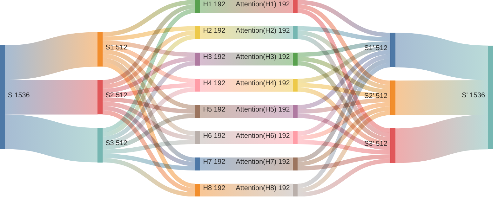
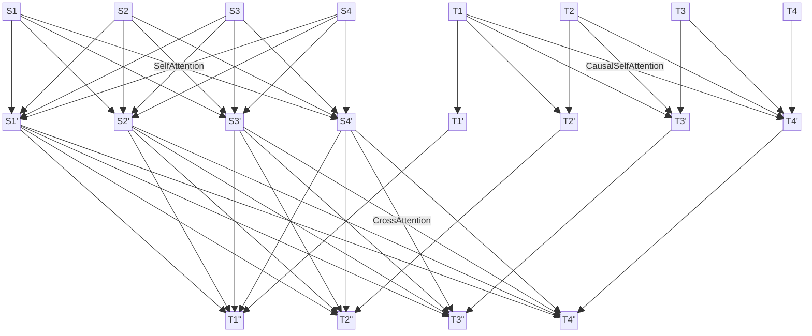

# Attention Is All You Need

Transformer 模型架构作为大语言模型（LLM）的基石，起源于 [Attention Is All You Need](https://arxiv.org/abs/1706.03762) 这篇论文。随着 LLM 的大热，吸引了很多研究者复现这篇论文。我找了一些来学习，但那些代码实现要么太过老旧跑不起来，要么太过复杂看不明白。于是我参考 [PyTorch 官方实现](https://github.com/pytorch/pytorch/blob/0d9c95cd7ee299e2e8c09df26d395be8775b506b/torch/nn/modules/transformer.py#L57)等资料，搞出这个**忠于原文、聚焦核心**的实现，舍弃一切预处理、工程优化等无关内容，力求简单明了，以便学习理解。

我重写 PyTorch 官方代码，压缩 10 倍，以 **124 行代码**涵盖模型的全部细节，并且代码结构尽力贴近原文描述。原来很多细节在原始论文中没有提及，在代码实现中才能看到。我用中译英验证了其有效性和正确性。由于中英两种语言差异较大，中译英是较为困难的任务，我在 [Seq2Seq(RNN + Attention)](https://github.com/ngolin/Seq2seq/) 上难以达到的效果，在 Transformer 上却轻松达到，体现了 Transformer 的强大。

## 一、快速开始

**模型定义：**[model.py](./model.py)，需配合原文阅读代码无额外注释，查看模型定义：

> ```bash
> $ python model.py
> ```

**模型验证：**[main.ipynb](./main.ipynb)，中译英验证模型实现是否正确，查看数据概要：

> ```bash
> $ python -m dataset
> ```

## 二、重要解读

### 1. 注意力机制

注意力（Attention）是 Transformer 架构的核心机制，细节较多，但本质上还是全连接（FNN）的变体。我们将看到，强如 Transformer, 细如 Attention, 也没有脱离 FNN 的底色。实际上 FNN 在模型设计中随处可见，以 FNN 为基础，RNN 加入循环逻辑，LSTM 通过门控机制解决长程依赖问题，GRU 进一步简化计算，但其计算单元还是 FNN；CNN 引入卷积计算，但仍然是层级结构；ResNet 增加跳跃连接，解决深层网络退化问题，但还是 FNN 的信息传递模式。注意力机制本质上也是加权求和和非线性变换，我们将从三个层面帮助理解：

1. 如何来理解注意力机制的本质？
2. 为什么要对权重缩放并归一化？
3. 注意力权重掩码有什么作用呢？

万变不离其宗，无论 Transformer/Attention 设计得多么精炒，我们依然可以看到那个简单而朴素的 FNN 影子。这是深度学习的魅力所在，更是一个强大的启示。当我们遇到新的问题或面临全新领域时，或许也要回到 FNN 的基础上进行求解和创新，通过拆解其层级结构，调整其连接方式，使 FNN 更有效地表征和适配数据；通过权重矩阵的多信号感知和激活函数的非线性变换，使 FNN 更高效地聚合和传递信息，从而赋予新的机制，解决新的问题。

#### 1.1 如何来理解注意力机制的本质？

注意力的核心计算逻辑同样是 $\mathbf{Y} = \mathbf{W} \cdot \mathbf{X}$, 只不过细节上有些调整，也换了不同的名称 $\mathbf{Q}$, $\mathbf{K}$, $\mathbf{V}$。如果 $\mathbf{Q}$, $\mathbf{K}$, $\mathbf{V}$ 来自同一个 Sequence 的线性变换，则称为**自注意力**；如果 $\mathbf{Q}$ 来自 $\mathbf{T} = [\mathbf{T}_1, \mathbf{T}_2, \dots, \mathbf{T}_T]$, 而 $\mathbf{K}$, $\mathbf{V}$ 来自不同的 $\mathbf{S} = [\mathbf{S}_1, \mathbf{S}_2, \dots, \mathbf{S}_S]$, 则称为**交叉注意力**；在自回归生成模型中，模型逐个生成 Token, 因此在训练时当前 Token 不能之后的 Tokens 加权求和，称为**因果注意力**。

|                                                                                                                                        **自注意力**                                                                                                                                         |                                                                                                                                                                                **因果自注意力**                                                                                                                                                                                 |                                                                                                                                                                      **交叉注意力**                                                                                                                                                                       |
| :-----------------------------------------------------------------------------------------------------------------------------------------------------------------------------------------------------------------------------------------------------------------------------------------: | :-----------------------------------------------------------------------------------------------------------------------------------------------------------------------------------------------------------------------------------------------------------------------------------------------------------------------------------------------------------------------------: | :-------------------------------------------------------------------------------------------------------------------------------------------------------------------------------------------------------------------------------------------------------------------------------------------------------------------------------------------------------: |
|                                                    $\mathbf{Q} = \mathbf{Q} ^ S = \text{Linear}(\mathbf{S})$<br/>$\mathbf{K} = \mathbf{K} ^ S = \text{Linear}(\mathbf{S})$<br/>$\mathbf{V} = \mathbf{V} ^ S = \text{Linear}(\mathbf{S})$                                                    |                                                                                              $\mathbf{Q} = \mathbf{Q} ^ T = \text{Linear}(\mathbf{T})$<br/>$\mathbf{K} = \mathbf{K} ^ T = \text{Linear}(\mathbf{T})$<br/>$\mathbf{V} = \mathbf{V} ^ T = \text{Linear}(\mathbf{T})$                                                                                              |                                                     $\mathbf{Q} = \mathbf{Q} ^ {T ^ \prime} = \text{Linear}(\mathbf{T} ^ \prime)$<br/>$\mathbf{K} = \mathbf{K} ^ {S ^ \prime} = \text{Linear}(\mathbf{S} ^ \prime)$<br/>$\mathbf{V} = \mathbf{V} ^ {S ^ \prime} = \text{Linear}(\mathbf{S} ^ \prime)$                                                     |
| $\mathbf{S} = \text{SelfAttention}(\mathbf{S}) = \mathbf{W} ^ \prime \cdot \mathbf{V}$<br/>$\mathbf{W} ^ \prime = \text{Softmax}(\frac{\mathbf{W} = \mathbf{Q} \cdot \mathbf{K} ^ T}{\sqrt{d = 512}})$<br/>$W _ {ij} = \mathbf{Q} _ i \cdot \mathbf{K} _ j, 1 \leqslant (i, j) \leqslant S$ | $\mathbf{T} = \text{CausalSelfAttention}(\mathbf{T}) = \mathbf{W} ^ \prime \cdot \mathbf{V}$<br/>$\mathbf{W} ^ \prime = \text{Softmax}(\frac{\mathbf{W} = \mathbf{Q} \cdot \mathbf{K} ^ T}{\sqrt{d = 512}} + \mathbf{M})$ <br/> $W _ {ij} = \mathbf{Q} _ i \cdot \mathbf{K} _ j, 1 \leqslant (i, j) \leqslant T$ <br/> $M _ {ij} = 0 \text{ if } i < j \text{ else } {-\infty}$ | $\mathbf{T} ^ \prime = \text{CrossAttention}(\mathbf{T} ^ \prime, \mathbf{S} ^ \prime) = \mathbf{W} ^ \prime \cdot \mathbf{V}$<br/>$\mathbf{W} ^ \prime = \text{Softmax}(\frac{\mathbf{W} = \mathbf{Q} \cdot \mathbf{K} ^ T}{\sqrt{d = 512}})$<br/>$W _ {ij} = \mathbf{Q} _ i \cdot \mathbf{K} _ j, 1 \leqslant i \leqslant T, 1 \leqslant j \leqslant S$ |
|                                                                                                                      $\mathbf{S} ^ \prime = \text{Linear}(\mathbf{S})$                                                                                                                      |                                                                                                                                                                $\mathbf{T} ^ \prime = \text{Linear}(\mathbf{T})$                                                                                                                                                                |                                                                                                                                            $\mathbf{T} ^ {\prime \prime} = \text{Linear}(\mathbf{T} ^ \prime)$                                                                                                                                            |

在 Transformer 架构中，编码器有一种自注意力，解码器有一种因果自注意力和交叉注意力。每种注意力都有 6 层 8 头，共 48 个注意力。所谓的 6 层，其实就是重复 6 次；正因为不止 1 头，才叫**多头注意力**。所谓的 8 头，就是把词嵌入的 512 维分为 8 组每组 64 维分别进行注意力加权求和，可以理解为 8 头注意力支持对一个 Token 多达 8 个不同的语义分别应用注意力机制。



所谓的加权求和，就是一个 Sequence 转换成另一个 Sequence, 新 Sequence 的每个 Token 为旧 Sequence 所有 Tokens 加权求和所得，也就是每个 Token 都融合了所有 Tokens 的信息。由于每个 Token 都要依赖上下文才能明确自身语义，加权求和正是出于这个考虑，每个 Token 都可以融合其他所有 Token 的信息来明确自身的语义，不同大小的权重分配代表不同程度的依赖。



#### 1.2 为什么要对权重缩放并归一化？

在注意力机制中，准确来说 $\mathbf{W} = \mathbf{Q} \cdot \mathbf{K}$ 叫注意力分数，对注意力分数除以 $\sqrt{d = 512}$ 进行缩放（Scaling）再用 Softmax 归一化（Normalization），也就是 $\mathbf{W} ^ \prime = \text{Softmax}(\frac{\mathbf{W = \mathbf{Q} \cdot \mathbf{K}}}{\sqrt{d = 512}})$ 才叫注意力权重。缩放修正注意力分数的方差，归一化再将其转化为有意义的概率分布，共同确保了注意力机制的有效性和稳定性，这就是**缩放点积注意力**（Scaled Dot-Product Attention）。

$$
\mathbf{Q} = \text{Linear}(\mathbf{S}), \mathbf{K} = \text{Linear}(\mathbf{S}), \mathbf{W} ^ \prime = \text{Softmax}(\frac{\mathbf{W} = \mathbf{Q} \cdot \mathbf{K}}{\sqrt{d = 512}})
$$

首先，为什么要在 Softmax 前除以 $\sqrt{d = 512}$ 进行缩放。原文提到，假设 $\mathbf{Q}$, $\mathbf{K}$ 都是均值为 0, 方差为 1 的独立随机变量，那么点积 $\mathbf{Q} \cdot \mathbf{K}$ 的均值是 0，方差是 $d = 512$。由于 Softmax 对极端输入值非常敏感，方差变大将可能导致 Softmax 梯度消失问题。通过除以 $\sqrt{d = 512}$ 可将方差拉回到 1 左右，Softmax 的输出处于一个梯度较大的值域内，使模型训练更稳定。

$$
a _ i = \text{Softmax}(z _ i) = \frac{e ^ {z _ i}}{\sum \limits _ j e ^ {z _ j}}, \frac{\partial a _ i}{\partial z _ j} = \begin{cases} a _ i(1 - a _ j) & \text{if } i = j \\
-a _ i a _ j & \text{if } i \neq j \end{cases}
$$

其次，为什么要用 Softmax 将注意力分数归一化。归一化的目的是将注意力分数转换为一个概率分布。这样，每个值都有一个清晰的解释：代表其被关注的概率或权重。转换后的概率分布直接用于对 $\mathbf{V}$ 向量进行加权求和, $\text{Softmax}(\frac{\mathbf{W} = \mathbf{Q} \cdot \mathbf{K}}{\sqrt{d = 512}}) \cdot \mathbf{V}$。权重之和为 1 确保了加权求和操作是稳定和合理的。如果权重没有归一化，总和可能很大或很小，会导致 $\mathbf{V}$ 向量的缩放不可控，破坏模型的稳定性。

$$
\mathbf{V} = \text{Linear}(\mathbf{S}), \mathbf{S} ^ \prime _ i = \sum \limits _ j W ^ \prime_ {ij} \cdot \mathbf{V} _ j, \sum \limits _ j W ^ \prime_ {ij} = 1
$$

#### 1.3 注意力权重掩码有什么作用呢？

在 Softmax 归一化之前，还需要对注意力分数加上掩码（Masking），通过将某些位置的注意力分数设置为 $-\infty$, 使其在 Softmax 计算后权重为 0, 并保持其他权重之和为 1, 从而在后续加权求和中被忽略。注意力权重掩码是确保模型正常训练和推理的重要技术，主要包括**因果掩码（Causal Mask）**和**填充掩码（Padding Mask）**，分别解决自回归生成中“信息泄露”和批量变长序列中“无效计算”问题。

```mermaid
block
  columns 15

    space M1M1["0"] M1M2["−∞"] M1M3["−∞"] M1M4["−∞"] M1M5["−∞"] space:3 S1S1["0"] S1S2["0"] S1S3["0"] S1S4["−∞"] S1S5["−∞"] space

    space  M2M1["0"] M2M2["0"] M2M3["−∞"] M2M4["−∞"] M2M5["−∞"] space:3 S2S1["0"] S2S2["0"] S2S3["0"] S2S4["−∞"] S2S5["−∞"] space

    space  M3M1["0"] M3M2["0"] M3M3["0"] M3M4["−∞"] M3M5["−∞"] space:3 S3S1["0"] S3S2["0"] S3S3["0"] S3S4["−∞"] S3S5["−∞"] space

    space M4M1["0"] M4M2["0"] M4M3["0"] M4M4["0"] M4M5["−∞"] space:3 S4S1["−∞"] S4S2["−∞"] S4S3["−∞"] S4S4["−∞"] S4S5["−∞"] space

    space M5M1["0"] M5M2["0"] M5M3["0"] M5M4["0"] M5M5["0"] space:3 S5S1["−∞"] S5S2["−∞"] S5S3["−∞"] S5S4["−∞"] S5S5["−∞"] space

    space:15

    space:3 R1C1[" "]:0 space:1 R1C2[" "]:0 space:7 R1C3[" "]:0 space:1 R1C4[" "]:0 space:3

    R1C1 --"因果掩码"---R1C2

    R1C3 --"填充掩码"---R1C4
```

首先，因果掩码主要用于解码器的因果自注意力，其核心目的是确保模型在训练时遵循推理时自回归生成的性质，不要“偷看”未来的信息。模型在推理时只能依赖前面已生成的 Tokens 逐个 Token 生成目标序列；但在训练时，整个目标序列是已知的，在训练当前 Token 时，不仅前面的 Tokens 是已知的，后面的 Tokens 也是已知的，所以要用因果掩码把后面的 Tokens 屏蔽掉，以防信息泄露导致模型在推理时性能下降。

```mermaid
block
  columns 25

    W11 W12 W13 W14 W15 space M1M1["0"] M1M2["−∞"] M1M3["−∞"] M1M4["−∞"] M1M5["−∞"] space WM1M1["W11"] WM1M2["−∞"] WM1M3["−∞"] WM1M4["−∞"] WM1M5["−∞"] space:3 W'11 W'12["0"] W'13["0"] W'14["0"] W'15["0"]

    W21 W22 W23 W24 W25 space M2M1["0"] M2M2["0"] M2M3["−∞"] M2M4["−∞"] M2M5["−∞"] space WM2M1["W21"] WM2M2["W22"] WM2M3["−∞"] WM2M4["−∞"] WM2M5["−∞"] space:3 W'21 W'22 W'23["0"] W'24["0"] W'25["0"]

    W31 W32 W33 W34 W35 +(("+")) M3M1["0"] M3M2["0"] M3M3["0"] M3M4["−∞"] M3M5["−∞"] =(("=")) WM3M1["W31"] WM3M2["W32"] WM3M3["W33"] WM3M4["−∞"] WM3M5["−∞"] space:3 W'31 W'32 W'33 W'34["0"] W'35["0"]

    W41 W42 W43 W44 W45 space M4M1["0"] M4M2["0"] M4M3["0"] M4M4["0"] M4M5["−∞"] space WM4M1["W41"] WM4M2["W42"] WM4M3["W43"] WM4M4["W44"] WM4M5["−∞"] space:3 W'41 W'42 W'43 W'44 W'45["0"]

    W51 W52 W53 W54 W55 space M5M1["0"] M5M2["0"] M5M3["0"] M5M4["0"] M5M5["0"] space WM5M1["W51"] WM5M2["W52"] WM5M3["W53"] WM5M4["W54"] WM5M5["W55"] space:3 W'51 W'52 W'53 W'54 W'55

    WM3M5 --"Softmax"---> W'31
```

其次，填充掩码在编码器和解码器中都会使用，主要用于处理变长序列。为了提高计算效率，就会把多个序列打包一起批量处理，但这些序列有长有短，短的缺口就需要用填充符（如 `<Pad>`）补全到同一长度。填充掩码的作用就是告诉模型在计算注意力权重时忽略这些无意义的填充符。因果掩码作用于同一序列的不同 Token, 而填充掩码作用于同一批量的不同序列。对于因果自注意力，既有因果掩码，也有填充掩码。

```mermaid
block
  columns 25

    W1S1["W11"] W1S2["W12"] W1S3["W13"] W1S4["W14"] W1S5["W15"] space M1S1["0"] M1S2["0"] M1S3["0"] M1S4["−∞"] M1S5["−∞"] space WM1S1["W11"] WM1S2["W12"] WM1S3["W13"] WM1S4["−∞"] WM1S5["−∞"] space:3 W'1S1["W'11"] W'1S2["W'12"] W'1S3["W'13"] W'1S4["0"] W'1S5["0"]

    W2S1["W21"] W2S2["W22"] W2S3["W23"] W2S4["W24"] W2S5["W25"] space M2S1["0"] M2S2["0"] M2S3["0"] M2S4["−∞"] M2S5["−∞"] space WM2S1["W21"] WM2S2["W22"] WM2S3["W23"] WM2S4["−∞"] WM2S5["−∞"] space:3 W'2S1["W'21"] W'2S2["W'22"] W'2S3["W'23"] W'2S4["0"] W'2S5["0"]

    W3S1["W31"] W3S2["W32"] W3S3["W33"] W3S4["W34"] W3S5["W35"] SM+(("+")) M3S1["0"] M3S2["0"] M3S3["0"] M3S4["−∞"] M3S5["−∞"] SM=(("=")) WM3S1["W31"] WM3S2["W32"] WM3S3["W33"] WM3S4["−∞"] WM3S5["−∞"] space:3 W'3S1["W'31"] W'3S2["W'32"] W'3S3["W'33"] W'3S4["0"] W'3S5["0"]

    W4S1["W41"] W4S2["W42"] W4S3["W43"] W4S4["W44"] W4S5["W45"] space M4S1["−∞"] M4S2["−∞"] M4S3["−∞"] M4S4["−∞"] M4S5["−∞"] space WM4S1["−∞"] WM4S2["−∞"] WM4S3["−∞"] WM4S4["−∞"] WM4S5["−∞"] space:3 W'4S1["0"] W'4S2["0"] W'4S3["0"] W'4S4["0"] W'4S5["0"]

    W5S1["W51"] W5S2["W52"] W5S3["W53"] W5S4["W54"] W5S5["W55"] space M5S1["−∞"] M5S2["−∞"] M5S3["−∞"] M5S4["−∞"] M5S5["−∞"] space WM5S1["−∞"] WM5S2["−∞"] WM5S3["−∞"] WM5S4["−∞"] WM5S5["−∞"] space:3 W'5S1["0"] W'5S2["0"] W'5S3["0"] W'5S4["0"] W'5S5["0"]

    WM3S5 --"Softmax"---> W'3S1

    space:25

    space:6 S1 S2 S3 S4["Pad"] S5["Pad"] space:14

    space:25

    W1T'1["W11"] W1T'2["W12"] W1T'3["W13"] W1T'4["W14"] W1T'5["W15"] space M1T'1["0"] M1T'2["0"] M1T'3["0"] M1T'4["−∞"] M1T'5["−∞"] space WM1T'1["W11"] WM1T'2["W12"] WM1T'3["W13"] WM1T'4["−∞"] WM1T'5["−∞"] space:3 W'1T'1["W'11"] W'1T'2["W'12"] W'1T'3["W'13"] W'1T'4["0"] W'1T'5["0"]

    W2T'1["W21"] W2T'2["W22"] W2T'3["W23"] W2T'4["W24"] W2T'5["W25"] space M2T'1["0"] M2T'2["0"] M2T'3["0"] M2T'4["−∞"] M2T'5["−∞"] space WM2T'1["W21"] WM2T'2["W22"] WM2T'3["W23"] WM2T'4["−∞"] WM2T'5["−∞"] space:3 W'2T'1["W'21"] W'2T'2["W'22"] W'2T'3["W'23"] W'2T'4["0"] W'2T'5["0"]

    W3T'1["W31"] W3T'2["W32"] W3T'3["W33"] W3T'4["W34"] W3T'5["W35"] T'M+(("+")) M3T'1["0"] M3T'2["0"] M3T'3["0"] M3T'4["−∞"] M3T'5["−∞"] T'M=(("=")) WM3T'1["W31"] WM3T'2["W32"] WM3T'3["W33"] WM3T'4["−∞"] WM3T'5["−∞"] space:3 W'3T'1["W'31"] W'3T'2["W'32"] W'3T'3["W'33"] W'3T'4["0"] W'3T'5["0"]

    W4T'1["W41"] W4T'2["W42"] W4T'3["W43"] W4T'4["W44"] W4T'5["W45"] space M4T'1["0"] M4T'2["0"] M4T'3["0"] M4T'4["−∞"] M4T'5["−∞"] space WM4T'1["W41"] WM4T'2["W42"] WM4T'3["W43"] WM4T'4["−∞"] WM4T'5["−∞"] space:3 W'4T'1["W'41"] W'4T'2["W'42"] W'4T'3["W'43"] W'4T'4["0"] W'4T'5["0"]

    W5T'1["W51"] W5T'2["W52"] W5T'3["W53"] W5T'4["W54"] W5T'5["W55"] space M5T'1["−∞"] M5T'2["−∞"] M5T'3["−∞"] M5T'4["−∞"] M5T'5["−∞"] space WM5T'1["−∞"] WM5T'2["−∞"] WM5T'3["−∞"] WM5T'4["−∞"] WM5T'5["−∞"] space:3 W'5T'1["0"] W'5T'2["0"] W'5T'3["0"] W'5T'4["0"] W'5T'5["0"]

    WM3T'5 --"Softmax"---> W'3T'1

    space:25

    space:6 T1 T2 T3 T4 T5["Pad"] space:14

    space:25

    W1T1["W11"] W1T2["−∞"] W1T3["−∞"] W1T4["−∞"] W1T5["−∞"] space M1T1["0"] M1T2["0"] M1T3["0"] M1T4["0"] M1T5["−∞"] space WM1T1["W11"] WM1T2["−∞"] WM1T3["−∞"] WM1T4["−∞"] WM1T5["−∞"] space:3 W'1T1["W'11"] W'1T2["0"] W'1T3["0"] W'1T4["0"] W'1T5["0"]

    W2T1["W21"] W2T2["W22"] W2T3["−∞"] W2T4["−∞"] W2T5["−∞"] space M2T1["0"] M2T2["0"] M2T3["0"] M2T4["0"] M2T5["−∞"] space WM2T1["W21"] WM2T2["W22"] WM2T3["−∞"] WM2T4["−∞"] WM2T5["−∞"] space:3 W'2T1["W'21"] W'2T2["W'22"] W'2T3["0"] W'2T4["0"] W'2T5["0"]

    W3T1["W31"] W3T2["W32"] W3T3["W33"] W3T4["−∞"] W3T5["−∞"] TM+(("+")) M3T1["0"] M3T2["0"] M3T3["0"] M3T4["0"] M3T5["−∞"] TM=(("=")) WM3T1["W31"] WM3T2["W32"] WM3T3["W33"] WM3T4["−∞"] WM3T5["−∞"] space:3 W'3T1["W'31"] W'3T2["W'32"] W'3T3["W'33"] W'3T4["0"] W'3T5["0"]

    W4T1["W41"] W4T2["W42"] W4T3["W43"] W4T4["W44"] W4T5["−∞"] space M4T1["0"] M4T2["0"] M4T3["0"] M4T4["0"] M4T5["−∞"] space WM4T1["W41"] WM4T2["W42"] WM4T3["W43"] WM4T4["W44"] WM4T5["−∞"] space:3 W'4T1["W'41"] W'4T2["W'42"] W'4T3["W'43"] W'4T4["W'44"] W'4T5["0"]

    W5T1["W51"] W5T2["W52"] W5T3["W53"] W5T4["W54"] W5T5["W55"] space M5T1["−∞"] M5T2["−∞"] M5T3["−∞"] M5T4["−∞"] M5T5["−∞"] space WM5T1["−∞"] WM5T2["−∞"] WM5T3["−∞"] WM5T4["−∞"] WM5T5["−∞"] space:3 W'5T1["0"] W'5T2["0"] W'5T3["0"] W'5T4["0"] W'5T5["0"]

    WM3T5 --"Softmax"---> W'3T1
```

### 2. LayerNorm 正则化

Transformer 架构的成功不仅源于其核心的注意力机制，还得益于一系列精心设计的正则化技术。这些技术有效防止过拟合，稳定训练过程，并提升模型的泛化能力。主要的正则化技术包括残差连接（Residual Connections）、丢弃连接（Dropout）和 LayerNorm 层归一化。其中的 LayerNorm 不仅起到稳定训练和加速收敛的作用，还间接影响数据分布和梯度行为，带来显著的正则化效果，与 BatchNorm 的差异如下：

|                    | LayerNorm                    | BatchNorm                      |
| :----------------- | :--------------------------- | :----------------------------- |
| **归一化维度**     | 沿**特征维度**（单样本内部） | 沿**批量维度**（同特征跨样本） |
| **对批大小的要求** | 不依赖，**对小批量友好**     | 严重依赖，小批量下效果差       |
| **主要应用场景**   | RNN, Transformer 等序列模型  | CNN 等视觉模型                 |

### 3. 词嵌入与位置编码

## 三、代码实现

## 四、参考资料

- 论文原文：[Attention Is All You Need](https://arxiv.org/abs/1706.03762)
- 论文解读：[Transformer 论文逐段精读](https://www.youtube.com/watch?v=nzqlFIcCSWQ)
- 官方实现：[pytorch/torch/nn/modules/transformer.py](https://github.com/pytorch/pytorch/blob/0d9c95cd7ee299e2e8c09df26d395be8775b506b/torch/nn/modules/transformer.py#L57)
- 官方示例：[examples/language_translation/src/model.py](https://github.com/pytorch/examples/blob/acc295dc7b90714f1bf47f06004fc19a7fe235c4/language_translation/src/model.py#L28)
- nanoGPT：[nanoGPT](https://github.com/karpathy/nanoGPT/blob/93a43d9a5c22450bbf06e78da2cb6eeef084b717/model.py#L52-L76)
