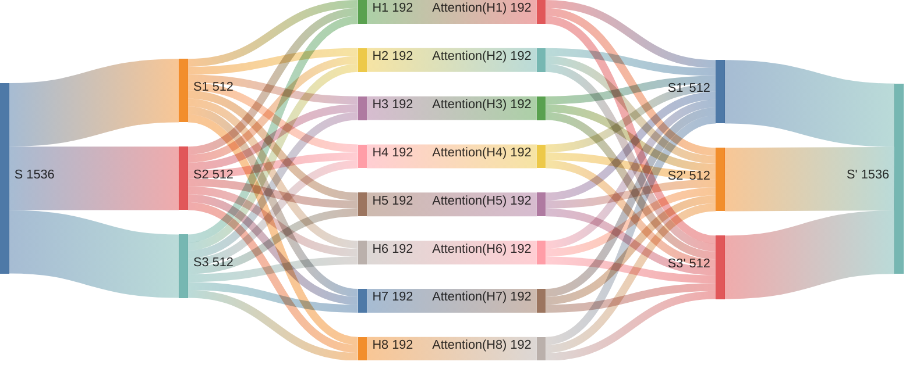
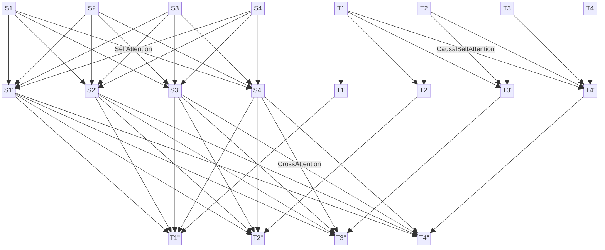

# Attention Is All You Need

Transformer 模型架构作为大语言模型（LLM）的基石，起源于 [Attention Is All You Need](https://arxiv.org/abs/1706.03762) 这篇论文。随着 LLM 的大热，吸引了很多研究者复现这篇论文。我找了一些来学习，但那些代码实现要么太过老旧跑不起来，要么太过复杂看不明白。于是我参考 [PyTorch 官方实现](https://github.com/pytorch/pytorch/blob/0d9c95cd7ee299e2e8c09df26d395be8775b506b/torch/nn/modules/transformer.py#L57)等资料，搞出这个**忠于原文、聚焦核心**的实现，舍弃一切预处理、工程优化等无关内容，力求简单明了，以便学习理解。

我重写 PyTorch 官方代码，压缩 10 倍，以 **124 行代码**涵盖模型的全部细节，并且代码结构尽力贴近原文描述。原来很多细节在原始论文中没有提及，在代码实现中才能看到。我用中译英验证了其有效性和正确性。由于中英两种语言差异较大，中译英是较为困难的任务，我在 [Seq2Seq(RNN + Attention)](https://github.com/ngolin/Seq2seq/) 上难以达到的效果，在 Transformer 上却轻松达到，体现了 Transformer 的强大。

## 一、快速开始

**模型定义：**[model.py](./model.py)，需配合原文阅读代码无额外注释，查看模型定义：

> ```bash
> $ python model.py
> ```

**模型验证：**[main.ipynb](./main.ipynb)，中译英验证模型实现是否正确，查看数据概要：

> ```bash
> $ python -m dataset
> ```

## 二、重要解读

### 1. 注意力机制

注意力（Attention）是 Transformer 架构的核心机制，细节较多，但本质上还是全连接（FNN）的变体。我们将看到，强如 Transformer, 细如 Attention, 也没有脱离 FNN 的底色。实际上 FNN 在模型设计中随处可见，以 FNN 为基础，RNN 加入循环逻辑，LSTM 通过门控机制解决长程依赖问题，GRU 进一步简化计算，但其计算单元还是 FNN；CNN 引入卷积计算，但仍然是层级结构；ResNet 增加跳跃连接，解决深层网络退化问题，但还是 FNN 的信息传递模式。注意力机制本质上也是加权求和和非线性变换，我们将从三个层面帮助理解：

1. 如何来理解注意力机制的本质？
2. 为什么要对权重缩放并归一化？
3. 注意力权重掩码有什么作用呢？

万变不离其宗，无论 Transformer/Attention 设计得多么精炒，我们依然可以看到那个简单而朴素的 FNN 影子。这是深度学习的魅力所在，更是一个强大的启示。当我们遇到新的问题或面临全新领域时，或许也要回到 FNN 的基础上进行求解和创新，通过拆解其层级结构，调整其连接方式，使 FNN 更有效地表征和适配数据；通过权重矩阵的多信号感知和激活函数的非线性变换，使 FNN 更高效地聚合和传递信息，从而赋予新的机制，解决新的问题。

#### 1.1 如何来理解注意力机制的本质？

注意力的核心计算逻辑同样是 $\mathbf{Y} = \mathbf{W} \cdot \mathbf{X}$, 只不过细节上有些调整，也换了不同的名称 $\mathbf{Q}$, $\mathbf{K}$, $\mathbf{V}$。如果 $\mathbf{Q}$, $\mathbf{K}$, $\mathbf{V}$ 来自同一个 Sequence 的线性变换，则称为**自注意力**；如果 $\mathbf{Q}$ 来自 $\mathbf{T} = [\mathbf{T}_1, \mathbf{T}_2, \dots, \mathbf{T}_T]$, 而 $\mathbf{K}$, $\mathbf{V}$ 来自不同的 $\mathbf{S} = [\mathbf{S}_1, \mathbf{S}_2, \dots, \mathbf{S}_S]$, 则称为**交叉注意力**；在自回归生成模型中，模型逐个生成 Token, 因此在训练时当前 Token 不能之后的 Tokens 加权求和，称为**因果注意力**。

|                                                                                                                                        **自注意力**                                                                                                                                         |                                                                                                                                                                                **因果自注意力**                                                                                                                                                                                 |                                                                                                                                                                      **交叉注意力**                                                                                                                                                                       |
| :-----------------------------------------------------------------------------------------------------------------------------------------------------------------------------------------------------------------------------------------------------------------------------------------: | :-----------------------------------------------------------------------------------------------------------------------------------------------------------------------------------------------------------------------------------------------------------------------------------------------------------------------------------------------------------------------------: | :-------------------------------------------------------------------------------------------------------------------------------------------------------------------------------------------------------------------------------------------------------------------------------------------------------------------------------------------------------: |
|                                                    $\mathbf{Q} = \mathbf{Q} ^ S = \text{Linear}(\mathbf{S})$<br/>$\mathbf{K} = \mathbf{K} ^ S = \text{Linear}(\mathbf{S})$<br/>$\mathbf{V} = \mathbf{V} ^ S = \text{Linear}(\mathbf{S})$                                                    |                                                                                              $\mathbf{Q} = \mathbf{Q} ^ T = \text{Linear}(\mathbf{T})$<br/>$\mathbf{K} = \mathbf{K} ^ T = \text{Linear}(\mathbf{T})$<br/>$\mathbf{V} = \mathbf{V} ^ T = \text{Linear}(\mathbf{T})$                                                                                              |                                                     $\mathbf{Q} = \mathbf{Q} ^ {T ^ \prime} = \text{Linear}(\mathbf{T} ^ \prime)$<br/>$\mathbf{K} = \mathbf{K} ^ {S ^ \prime} = \text{Linear}(\mathbf{S} ^ \prime)$<br/>$\mathbf{V} = \mathbf{V} ^ {S ^ \prime} = \text{Linear}(\mathbf{S} ^ \prime)$                                                     |
| $\mathbf{S} = \text{SelfAttention}(\mathbf{S}) = \mathbf{W} ^ \prime \cdot \mathbf{V}$<br/>$\mathbf{W} ^ \prime = \text{Softmax}(\frac{\mathbf{W} = \mathbf{Q} \cdot \mathbf{K} ^ T}{\sqrt{d = 512}})$<br/>$W _ {ij} = \mathbf{Q} _ i \cdot \mathbf{K} _ j, 1 \leqslant (i, j) \leqslant S$ | $\mathbf{T} = \text{CausalSelfAttention}(\mathbf{T}) = \mathbf{W} ^ \prime \cdot \mathbf{V}$<br/>$\mathbf{W} ^ \prime = \text{Softmax}(\frac{\mathbf{W} = \mathbf{Q} \cdot \mathbf{K} ^ T}{\sqrt{d = 512}} + \mathbf{M})$ <br/> $W _ {ij} = \mathbf{Q} _ i \cdot \mathbf{K} _ j, 1 \leqslant (i, j) \leqslant T$ <br/> $M _ {ij} = 0 \text{ if } i < j \text{ else } {-\infty}$ | $\mathbf{T} ^ \prime = \text{CrossAttention}(\mathbf{T} ^ \prime, \mathbf{S} ^ \prime) = \mathbf{W} ^ \prime \cdot \mathbf{V}$<br/>$\mathbf{W} ^ \prime = \text{Softmax}(\frac{\mathbf{W} = \mathbf{Q} \cdot \mathbf{K} ^ T}{\sqrt{d = 512}})$<br/>$W _ {ij} = \mathbf{Q} _ i \cdot \mathbf{K} _ j, 1 \leqslant i \leqslant T, 1 \leqslant j \leqslant S$ |
|                                                                                                                      $\mathbf{S} ^ \prime = \text{Linear}(\mathbf{S})$                                                                                                                      |                                                                                                                                                                $\mathbf{T} ^ \prime = \text{Linear}(\mathbf{T})$                                                                                                                                                                |                                                                                                                                            $\mathbf{T} ^ {\prime \prime} = \text{Linear}(\mathbf{T} ^ \prime)$                                                                                                                                            |

在 Transformer 架构中，编码器有一种自注意力，解码器有一种因果自注意力和交叉注意力。每种注意力都有 6 层 8 头，共 48 个注意力。所谓的 6 层，其实就是重复 6 次；正因为不止 1 头，才叫**多头注意力**。所谓的 8 头，就是把词嵌入的 512 维分为 8 组每组 64 维分别进行注意力加权求和，可以理解为 8 头注意力支持对一个 Token 多达 8 个不同的语义分别应用注意力机制。



所谓的加权求和，就是一个 Sequence 转换成另一个 Sequence, 新 Sequence 的每个 Token 为旧 Sequence 所有 Tokens 加权求和所得，也就是每个 Token 都融合了所有 Tokens 的信息。由于每个 Token 都要依赖上下文才能明确自身语义，加权求和正是出于这个考虑，每个 Token 都可以融合其他所有 Token 的信息来明确自身的语义，不同大小的权重分配代表不同程度的依赖。



#### 1.2 为什么要对权重缩放并归一化？

在注意力机制中，准确来说 $\mathbf{W} = \mathbf{Q} \cdot \mathbf{K}$ 叫注意力分数，对注意力分数除以 $\sqrt{d = 512}$ 进行缩放（Scaling）再用 Softmax 归一化（Normalization），也就是 $\mathbf{W} ^ \prime = \text{Softmax}(\frac{\mathbf{W = \mathbf{Q} \cdot \mathbf{K}}}{\sqrt{d = 512}})$ 才叫注意力权重。缩放修正注意力分数的方差，归一化再将其转化为有意义的概率分布，共同确保了注意力机制的有效性和稳定性，这就是**缩放点积注意力**（Scaled Dot-Product Attention）。

$$
\mathbf{Q} = \text{Linear}(\mathbf{S}), \mathbf{K} = \text{Linear}(\mathbf{S}), \mathbf{W} ^ \prime = \text{Softmax}(\frac{\mathbf{W} = \mathbf{Q} \cdot \mathbf{K}}{\sqrt{d = 512}})
$$

首先，为什么要在 Softmax 前除以 $\sqrt{d = 512}$ 进行缩放。原文提到，假设 $\mathbf{Q}$, $\mathbf{K}$ 都是均值为 0, 方差为 1 的独立随机变量，那么点积 $\mathbf{Q} \cdot \mathbf{K}$ 的均值是 0，方差是 $d = 512$。由于 Softmax 对极端输入值非常敏感，方差变大将可能导致 Softmax 梯度消失问题。通过除以 $\sqrt{d = 512}$ 可将方差拉回到 1 左右，Softmax 的输出处于一个梯度较大的值域内，使模型训练更稳定。

$$
a _ i = \text{Softmax}(z _ i) = \frac{e ^ {z _ i}}{\sum \limits _ j e ^ {z _ j}}, \frac{\partial a _ i}{\partial z _ j} = \begin{cases} a _ i(1 - a _ j) & \text{if } i = j \\
-a _ i a _ j & \text{if } i \neq j \end{cases}
$$

其次，为什么要用 Softmax 将注意力分数归一化。归一化的目的是将注意力分数转换为一个概率分布。这样，每个值都有一个清晰的解释：代表其被关注的概率或权重。转换后的概率分布直接用于对 $\mathbf{V}$ 向量进行加权求和, $\text{Softmax}(\frac{\mathbf{W} = \mathbf{Q} \cdot \mathbf{K}}{\sqrt{d = 512}}) \cdot \mathbf{V}$。权重之和为 1 确保了加权求和操作是稳定和合理的。如果权重没有归一化，总和可能很大或很小，会导致 $\mathbf{V}$ 向量的缩放不可控，破坏模型的稳定性。

$$
\mathbf{V} = \text{Linear}(\mathbf{S}), \mathbf{S} ^ \prime _ i = \sum \limits _ j W ^ \prime_ {ij} \cdot \mathbf{V} _ j, \sum \limits _ j W ^ \prime_ {ij} = 1
$$

#### 1.3 注意力权重掩码有什么作用呢？

在 Softmax 归一化之前，还需要对注意力分数加上掩码（Masking），通过将某些位置的注意力分数设置为 $-\infty$, 使其在 Softmax 计算后权重为 0, 并保持其他权重之和为 1, 从而在后续加权求和中被忽略。注意力权重掩码是确保模型正常训练和推理的重要技术，主要包括**因果掩码（Causal Mask）**和**填充掩码（Padding Mask）**，分别解决自回归生成中“信息泄露”和批量变长序列中“无效计算”问题。

```mermaid
block
  columns 15

    space S1S1["0"] S1S2["0"] S1S3["0"] S1S4["−∞"] S1S5["−∞"] space:3 M1M1["0"] M1M2["−∞"] M1M3["−∞"] M1M4["−∞"] M1M5["−∞"] space:1

    space S2S1["0"] S2S2["0"] S2S3["0"] S2S4["−∞"] S2S5["−∞"] space:3  M2M1["0"] M2M2["0"] M2M3["−∞"] M2M4["−∞"] M2M5["−∞"] space:1

    space S3S1["0"] S3S2["0"] S3S3["0"] S3S4["−∞"] S3S5["−∞"] space:3  M3M1["0"] M3M2["0"] M3M3["0"] M3M4["−∞"] M3M5["−∞"] space:1

    space S4S1["−∞"] S4S2["−∞"] S4S3["−∞"] S4S4["−∞"] S4S5["−∞"] space:3 M4M1["0"] M4M2["0"] M4M3["0"] M4M4["0"] M4M5["−∞"] space:1

    space S5S1["−∞"] S5S2["−∞"] S5S3["−∞"] S5S4["−∞"] S5S5["−∞"] space:3 M5M1["0"] M5M2["0"] M5M3["0"] M5M4["0"] M5M5["0"] space:1

    space:15

    space:3 R1C1[" "]:0 space:1 R1C2[" "]:0 space:7 R1C3[" "]:0 space:1 R1C4[" "]:0 space:3

    R1C1 --"填充掩码"--- R1C2

    R1C3 --"因果掩码"---R1C4
```

### 2. LayerNorm 正则化

### 3. 词嵌入与位置编码

## 三、代码实现

## 四、参考资料

- 论文原文：[Attention Is All You Need](https://arxiv.org/abs/1706.03762)
- 论文解读：[Transformer 论文逐段精读](https://www.youtube.com/watch?v=nzqlFIcCSWQ)
- 官方实现：[pytorch/torch/nn/modules/transformer.py](https://github.com/pytorch/pytorch/blob/0d9c95cd7ee299e2e8c09df26d395be8775b506b/torch/nn/modules/transformer.py#L57)
- 官方示例：[examples/language_translation/src/model.py](https://github.com/pytorch/examples/blob/acc295dc7b90714f1bf47f06004fc19a7fe235c4/language_translation/src/model.py#L28)
- nanoGPT：[nanoGPT](https://github.com/karpathy/nanoGPT/blob/93a43d9a5c22450bbf06e78da2cb6eeef084b717/model.py#L52-L76)
